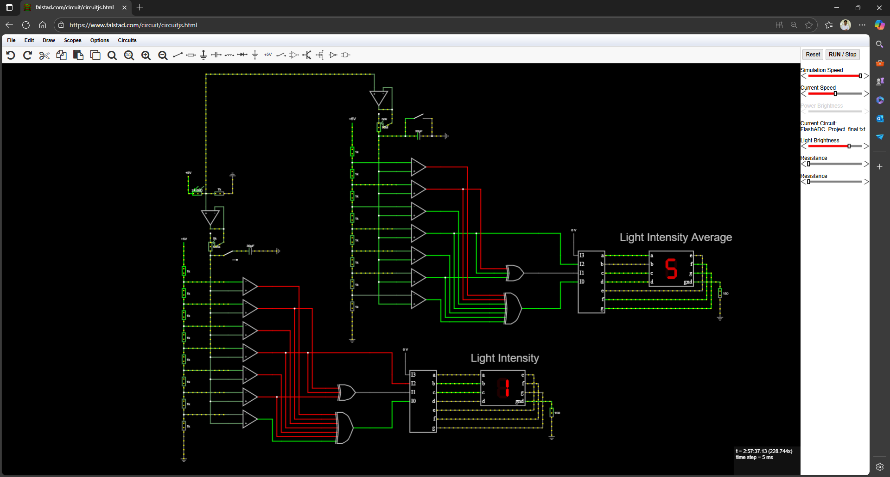
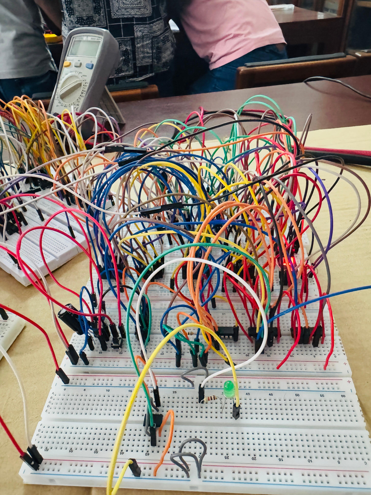
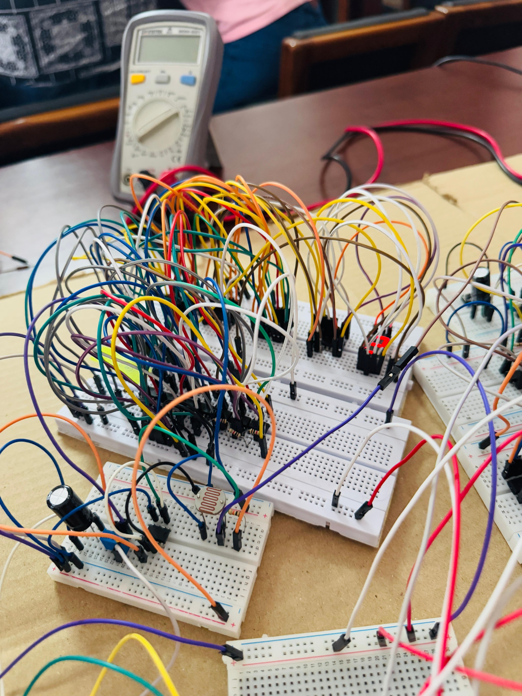

# Advanced Light Intensity Indicator (ALII) – DSP Project (Semester 3)

## 📌 Overview
This project implements an **Advanced Light Intensity Indicator (ALII)** using basic electronic components and Digital Signal Processing concepts.  
The system monitors real-time light intensity, displays its level, and incorporates an averaging and delay mechanism to improve stability and reliability.  

The core objective is to provide accurate light intensity readings while filtering out false triggers caused by sudden flashes (e.g., lightning). Additionally, it provides an averaged light intensity reading over longer periods for better environmental monitoring.  

---

## 🚀 Features
- **Light Sensing**
  - LDR used to detect light intensity.  
  - Output fed into a unity gain buffer (op-amp) to avoid loading effects.  

- **Instant Display Mode**
  - Direct output from LDR (through buffer and comparator stages).  
  - Compared against 7 reference voltages via a row of op-amps.  
  - Priority encoder + 7-segment decoder used to display light level (0–7).  

- **Delay Mode (RC Filtering)**
  - Switch activates an RC delay circuit (adjustable 30–300 s).  
  - Prevents false triggers due to sudden light changes (e.g., flashes).  
  - Potentiometer used to fine-tune delay.  

- **Average Intensity Measurement**
  - RC averaging circuit with ~300 s time constant.  
  - Provides a smooth average light intensity value over 300–900 s.  
  - Display shows average level (0–7).  

- **Control Options**
  - Switch to enable/disable delay feature.  
  - Adjustable potentiometer for delay and averaging time.  

---

## 🔧 Falstad Simulation
The project was simulated on **Falstad Circuit Simulator**.  

  

---

## 🛠 Hardware Implementation
Snapshots of the hardware prototype:  

  
    

---

## 📂 Repository Contents
- `FlashADC_Project_final.txt` → Falstad simulation file.  
- `Project.pdf` → Project description document.  
- `/images/` → Circuit diagrams and project build photos.  
- `README.md` → Documentation (this file).  

---

## 🌍 Applications
- Energy conservation through intelligent light monitoring.  
- Preventing false triggers in outdoor lighting systems.  
- Averaged intensity monitoring for research/field data collection.  

---
